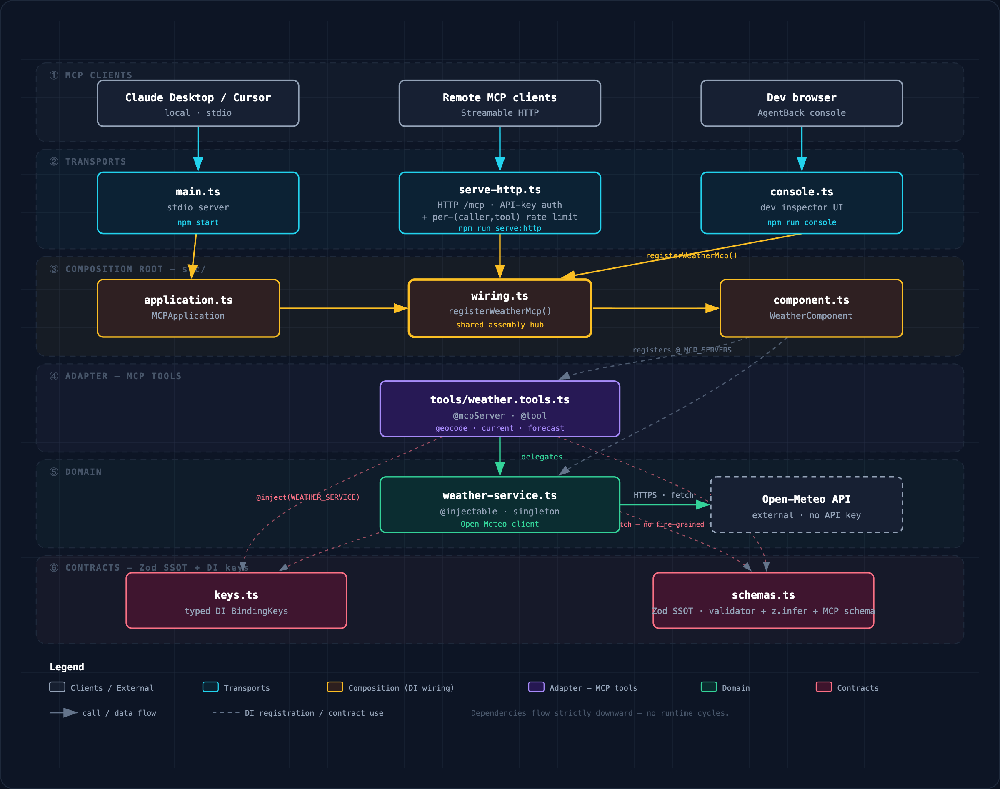

# weather-mcp

An MCP server built on [AgentBack](https://agentback.dev) that exposes weather
data from the free [Open-Meteo](https://open-meteo.com) API — **no API key
required**. Decorator-driven tools with Zod input/output schemas, served over
stdio, Streamable HTTP, or a dev console from one set of DI wiring.

```bash
npm install
npm run build && npm start      # stdio MCP server (for Claude Desktop / Cursor)
npm run serve:http              # remote MCP server over HTTP at /mcp
npm test                        # in-memory MCP session, no process spawn
npm run console                 # dev web UI at http://localhost:3000/console
```

## Architecture

Five layers, dependencies flowing strictly downward (Transports → Composition →
Adapter → Domain → Contracts). Three transports share one DI wiring.



See [`docs/architecture.md`](docs/architecture.md) for the layer-by-layer
breakdown and runtime flow (with an editable Mermaid source). The diagram is
also available as an interactive, exportable page —
[`docs/architecture-diagram.html`](docs/architecture-diagram.html).

## Transports

The same tools and DI wiring (`src/wiring.ts`) are served three ways:

| Entry | Command | Transport | Use |
| ----- | ------- | --------- | --- |
| `src/main.ts` | `npm start` | stdio | Local — wire into Claude Desktop / Cursor. |
| `src/serve-http.ts` | `npm run serve:http` | Streamable HTTP at `POST/GET/DELETE /mcp` | Remote clients over the network. |
| `src/console.ts` | `npm run console` | HTTP web UI | Development inspector (see below). |

### HTTP transport

`npm run serve:http` exposes the server at `http://localhost:3000/mcp`
(`PORT=3939 npm run serve:http` to change the port). Point any Streamable-HTTP
MCP client at that URL.

**Auth:** every request needs a valid API key in the `x-api-key` header (or
`?apiKey=`). Keys come from `MCP_API_KEYS` (comma-separated); if unset, a
`dev-local-key` is generated and printed to stderr so local runs still work.

```bash
MCP_API_KEYS=key1,key2 PORT=3939 npm run serve:http
# client must send:  x-api-key: key1
```

**Rate limiting:** `tools/call` is throttled per (caller, tool) — 60/min by
default, with `get_forecast` capped tighter at 20/min. Over the limit returns a
JSON-RPC 429 with `Retry-After`. Both are configured in `src/serve-http.ts`.

> For public deployment also set `allowedHosts`/`allowedOrigins` on
> `installMcpHttp` (DNS-rebinding protection), and consider a Redis `store` for
> the rate limiter so buckets are shared across instances.

## Dev console

`npm run console` starts the [AgentBack console](https://agentback.dev) — a web
UI that composes the **MCP inspector** (list and invoke your tools from a form),
the **OpenAPI/Swagger explorer**, and a **DI context explorer**. Override the
port with `PORT=3737 npm run console`.

The console serves over HTTP, so it runs a `RestApplication` (`src/console.ts`)
that reuses the exact same tool wiring as the stdio server (`src/wiring.ts`).
It's a development tool — the stdio entry point (`src/main.ts`) is what you wire
into Claude Desktop / Cursor.

## Tools

| Tool                  | Purpose                                                                 |
| --------------------- | ----------------------------------------------------------------------- |
| `geocode_location`    | Resolve a place name (e.g. "Tokyo") to candidate latitude/longitude.    |
| `get_current_weather` | Current conditions by `city` name **or** `latitude`+`longitude`.        |
| `get_forecast`        | Daily forecast (1–16 days) by `city` **or** `latitude`+`longitude`.     |

Each tool accepts `temperature_unit` (`celsius`/`fahrenheit`) and
`wind_speed_unit` (`kmh`/`ms`/`mph`/`kn`). When you pass a `city`, it is
geocoded automatically; pass coordinates directly to skip that step.

## How it's wired

- **`src/schemas.ts`** — the single source of truth. Each Zod schema is
  simultaneously the runtime validator, the `z.infer` type, and the
  agent-visible MCP input/output schema.
- **`src/keys.ts`** — typed DI keys. `WEATHER_SERVICE =
  BindingKey.create<WeatherService>('services.weather')` ties the key to its
  type, so the binding and every `@inject(WEATHER_SERVICE)` are type-checked.
- **`src/weather-service.ts`** — `WeatherService`, a stateless Open-Meteo client.
  `@injectable` declares its own binding: the `WEATHER_SERVICE` key
  (`ContextTags.KEY`) and singleton scope — it's pure I/O, so one shared
  instance is reused.
- **`src/tools/weather.tools.ts`** — the `@mcpServer()` tool class. `@mcpServer`
  is built on `@injectable`: it makes the class an _extension_ of the
  `MCP_SERVERS` extension point (singleton by default). Each `@tool` carries its
  Zod schemas and delegates to the injected `WeatherService`.
- **`src/component.ts`** — `WeatherComponent` packages the static DI
  contributions in one manifest: `MCPComponent` plus both `services`
  (`WeatherTools`, `WeatherService`). A tool class is a plain service — the MCP
  server discovers it as an `MCP_SERVERS` extension and resolves it through its
  binding, so constructor `@inject` is honored (no `controller` needed).
- **`src/wiring.ts`** — `registerWeatherMcp(app, stdio)` adds `WeatherComponent`
  and applies the per-entry transport config (stdio on/off). Shared by all three
  entry points, so they stay in lockstep.
- **`src/serve-http.ts`** — exports `buildHttpApp()` (builds, doesn't start) so
  tests can drive the api-key auth + rate-limit gate; the CLI run is guarded by
  `isMain(import.meta)`.

## Claude Desktop / Cursor config

```json
{
  "mcpServers": {
    "weather-mcp": {
      "command": "node",
      "args": ["/absolute/path/to/weather-mcp/dist/main.js"]
    }
  }
}
```
