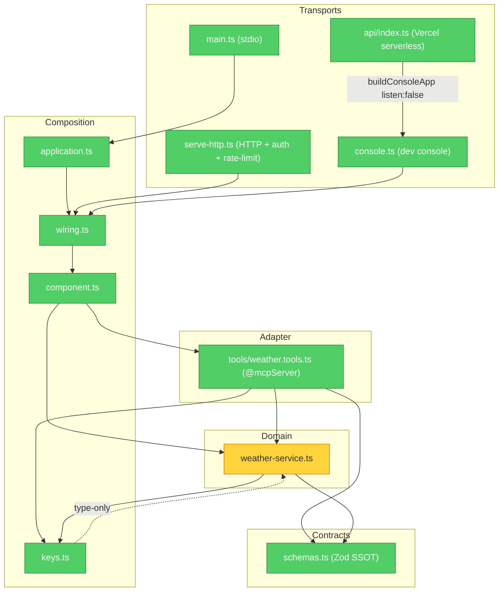

# Architecture

`weather-mcp` is one deployable service (~600 LOC) that exposes Open-Meteo
weather data as MCP tools, served three ways from a single DI wiring (stdio,
Streamable HTTP, and a dev console — the console also runs serverless on Vercel
at [agentback-demo.vercel.app](https://agentback-demo.vercel.app/)). The code is
organized into five layers with dependencies flowing strictly **downward**:
Transports → Composition → Adapter → Domain → Contracts.

> The image above is the rendered view. An interactive, exportable version lives
> at [`docs/architecture-diagram.html`](./architecture-diagram.html) (PNG/PDF
> export built in); the Mermaid block below is the editable source.

## Module dependency graph

Dependencies flow strictly downward. No runtime cycles. `wiring.ts` and
`schemas.ts` are the deliberate convergence points — three transports share one
wiring path, and the service + tools share one schema source. That
centralization is the design thesis, not a blast-radius defect.

## Layers

| Layer | File(s) | Responsibility |
| ----- | ------- | -------------- |
| **Transports** | `main.ts`, `serve-http.ts`, `console.ts`, `api/index.ts` | Entry points (stdio / Streamable HTTP / dev console). Each adapts a runtime to the shared wiring; `serve-http.ts` adds API-key auth + per-(caller, tool) rate limiting. `api/index.ts` is a thin Vercel wrapper over `console.ts`'s `buildConsoleApp({listen: false})` — same routes, no port bound, the platform owns the listener. |
| **Composition** | `application.ts`, `wiring.ts`, `component.ts`, `keys.ts` | The composition root. `wiring.ts` (`registerWeatherMcp`) is the single assembly path all transports call; `component.ts` packages the DI contributions; `keys.ts` holds typed `BindingKey`s. |
| **Adapter** | `tools/weather.tools.ts` | The `@mcpServer()` tool class — an extension of the `MCP_SERVERS` extension point. Each `@tool` carries its Zod I/O schemas and delegates to the injected `WeatherService`. |
| **Domain** | `weather-service.ts` | Stateless `@injectable` singleton: the Open-Meteo client. WMO-code translation, unit fallback, and response shaping live here. |
| **Contracts** | `schemas.ts` | The Zod single source of truth — each schema is simultaneously the runtime validator, the `z.infer` type, and the agent-visible MCP schema. (`keys.ts` is the DI counterpart.) |

## Runtime flow

1. An **MCP client** (Claude Desktop / Cursor over stdio, a remote client over
   HTTP, or the dev console) connects through a **transport**.
2. The transport hands off to the shared **wiring** (`registerWeatherMcp`),
   which has registered `WeatherComponent` — exposing `WeatherTools` as an
   `MCP_SERVERS` extension and binding `WeatherService`.
3. A `tools/call` resolves to a `@tool` on **`weather.tools.ts`**, which
   validates input against the **Zod schema** and **delegates** to the injected
   `WeatherService`.
4. **`weather-service.ts`** calls the **Open-Meteo API** over HTTPS, shapes the
   response, and validates the output against the schema on the way back.

## Deployment

The console transport runs two ways from the **same** `buildConsoleApp()`:

- **Long-running** — `npm run console` calls `app.start()` with `listen: true`,
  binding a port (local dev / a persistent host).
- **Serverless** — on Vercel, `api/index.ts` calls `buildConsoleApp({listen:
  false})`: `app.start()` mounts every route but binds no port, and the handler
  hands Vercel the app's `expressApp`. `vercel.json` rewrites all paths to the
  function and `includeFiles`-traces the on-disk static assets (the console
  client bundle + `swagger-ui-dist`) that nft can't follow on its own. Live at
  [agentback-demo.vercel.app](https://agentback-demo.vercel.app/); pushes to
  `main` auto-deploy.

## Known structural note

`weather-service.ts` performs all network I/O through a module-level `getJson()`
that calls global `fetch` directly — there is no fine-grained injection seam at
the Open-Meteo boundary, so the service's logic can't be unit-tested without a
live call. The coarse seam (overriding the whole `WEATHER_SERVICE` binding via
`createTestApp({overrides})`) exists; the fine one does not. See
[`brooks-lint-audit.md`](../brooks-lint-audit.md) for the full assessment.
